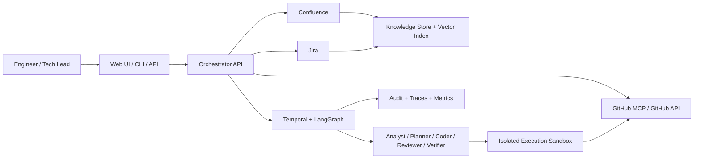
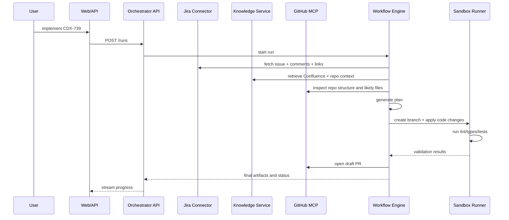
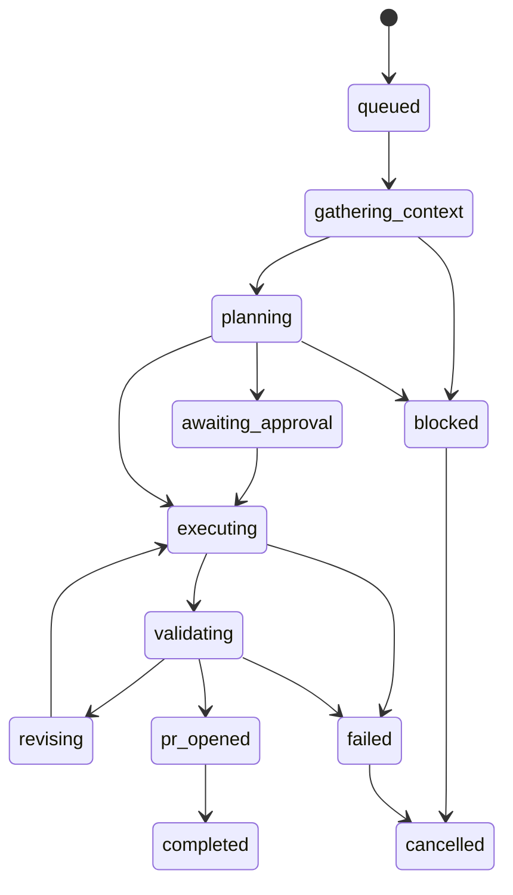

# High-Level Design (HLD) — AI Delivery Orchestrator

## 1. System Overview

The orchestrator is a **workflow-driven AI system** composed of six major layers:

1. **Experience Layer** — web UI, API, CLI
2. **Integration Layer** — GitHub, Jira, Confluence connectors
3. **Knowledge Layer** — ingestion, chunking, embeddings, retrieval
4. **Orchestration Layer** — supervisor workflow and specialist agents
5. **Execution Layer** — sandbox runner, git operations, validation, PR handling
6. **Governance Layer** — auth, approvals, policies, telemetry, audit

---

## 2. System Context Diagram



---

## 3. Primary Runtime Flow

### Command: `implement CDX-739`



---

## 4. Major Components

### 4.1 Operator UI (`apps/web`)

Responsibilities:

- command input (`explain`, `plan`, `implement`),
- live run progress,
- display citations, diffs, and validation output,
- human approval actions,
- settings page for connector status and policies.

### 4.2 Orchestrator API (`apps/orchestrator`)

Responsibilities:

- accept commands,
- authenticate users,
- create and track runs,
- invoke workflows,
- expose SSE/WebSocket progress streams,
- surface artifacts and run history.

### 4.3 Connectors (`packages/connectors`)

Responsibilities:

- GitHub repo access and PR actions,
- Jira issue reading,
- Confluence page ingestion,
- token refresh, pagination, retries, ACL mapping.

### 4.4 Knowledge Service (`packages/knowledge`)

Responsibilities:

- canonical document storage,
- chunking + embedding,
- hybrid retrieval and reranking,
- context-pack generation.

### 4.5 Workflow/Agent Runtime (`packages/workflows`, `packages/agents`)

Responsibilities:

- manage the agent state machine,
- enforce loop limits and budgets,
- preserve intermediate state,
- call tools and policies.

### 4.6 Execution Service (`packages/execution`)

Responsibilities:

- branch creation,
- workspace checkout,
- code editing,
- command execution,
- artifact collection,
- PR and commit helpers.

---

## 5. Deployment View

### Logical deployment

```text
[Next.js UI] ---> [Orchestrator API]
                     | \
                     |  \--> [Temporal workers]
                     |  \--> [Knowledge service]
                     |  \--> [Execution worker pool]
                     |
                     +--> [Postgres + pgvector]
                     +--> [Redis]
                     +--> [Secret Manager]
                     +--> [Observability stack]
```

### Recommended environments

- **dev** — local Docker compose for Postgres, Redis, Temporal
- **staging** — isolated integrations and synthetic Jira/Confluence space
- **prod** — multi-tenant env with secret segregation, audit retention, SSO

---

## 6. Monorepo Mapping

Recommended additions to current workspace:

```text
apps/
  web/
    app/
      runs/
      settings/
      projects/
  orchestrator/
    src/
      api/
      workers/
      temporal/
packages/
  domain/
  connectors/
  knowledge/
  agents/
  workflows/
  execution/
  observability/
```

---

## 7. Run Lifecycle State Machine



### State meanings

- `queued`: request accepted but not started
- `gathering_context`: connectors + RAG retrieval in progress
- `planning`: structured plan generation
- `awaiting_approval`: optional human checkpoint
- `executing`: code changes occurring in sandbox
- `validating`: build/test/review execution
- `revising`: feedback loop after failed validation
- `pr_opened`: draft or ready PR created
- `completed`: success with evidence persisted
- `blocked`: missing context, permissions, or ambiguous requirement
- `failed`: unrecoverable error after retries

---

## 8. Data Flow Summary

1. **Command intake** creates a `Run` record.
2. **Jira connector** normalizes the work item.
3. **Knowledge service** fetches indexed Confluence/Jira/repo context.
4. **Repo analyzer** identifies likely files and patterns.
5. **Planner agent** emits executable task units.
6. **Coder agent** applies scoped changes in sandbox.
7. **Verifier** runs repo commands and assesses acceptance criteria.
8. **Reviewer** checks security/style/architecture concerns.
9. **PR publisher** creates a draft PR and posts findings.

---

## 9. Architecture Decisions

### AD-1 Durable workflows over ad hoc queues

Use **Temporal** because implementing retries, long waits, and resume manually with plain queues is error-prone.

### AD-2 Hybrid retrieval over vector-only search

Use **BM25 + embeddings + reranking** to improve precision on enterprise text like ticket IDs, acronyms, and component names.

### AD-3 Structured outputs everywhere

All agent outputs must conform to strict JSON schemas; free-form prose cannot drive workflow transitions.

### AD-4 Human approvals for risky actions

Merges, secrets access changes, infrastructure changes, or broad file edits require explicit human approval.

---

## 10. Scalability Plan

### Horizontal scale points

- multiple Temporal workers for parallel runs,
- sharded execution workers for repo sandboxes,
- read replicas for retrieval-heavy knowledge queries,
- Redis caching for frequent ticket lookups.

### Isolation strategy

- each project connection has separate connector credentials,
- each run gets its own workspace and artifact directory,
- execution workers are separated from the public API plane.

---

## 11. Failure Handling at HLD Level

| Failure                    | Behavior                                                |
| -------------------------- | ------------------------------------------------------- |
| Jira unavailable           | mark run as `blocked` and retry on backoff              |
| Confluence sync stale      | continue with freshness warning and cite last sync time |
| GitHub permissions missing | stop before execution and request admin action          |
| Tests fail after change    | enter bounded revise loop                               |
| Agent output invalid       | reject output and reprompt with schema errors           |

---

## 12. Security Model Summary

- SSO for user auth
- project-scoped RBAC
- secrets in external secret manager
- all external content tagged with ACL metadata
- audit logging for every workflow step and tool invocation
- sandboxed code execution with egress restrictions where possible
